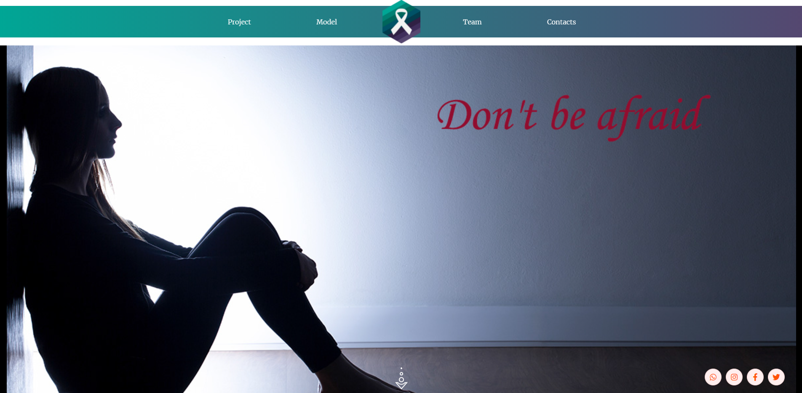
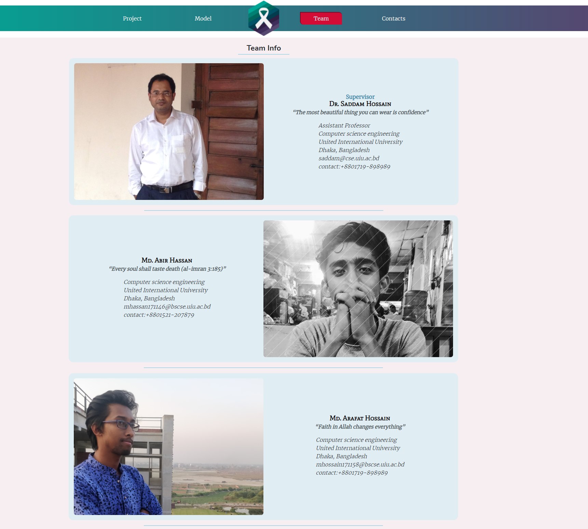
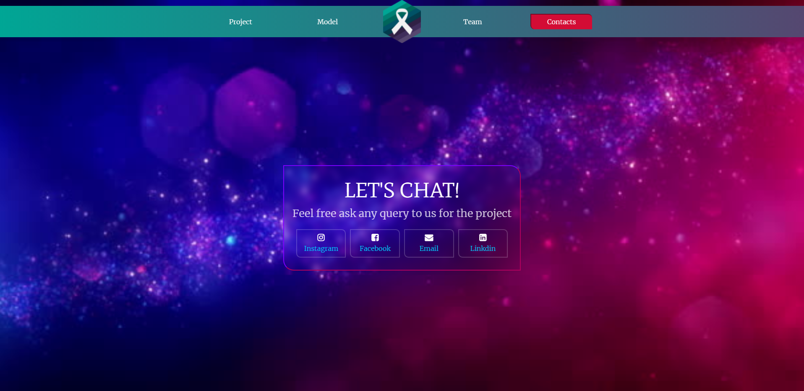
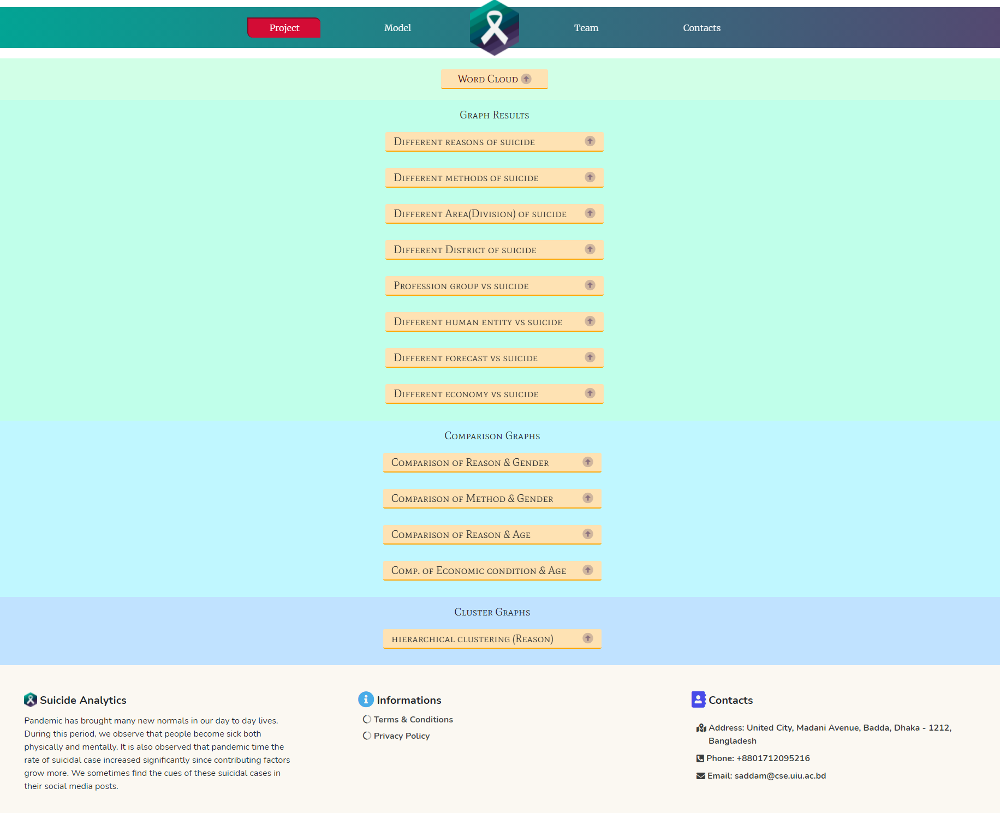
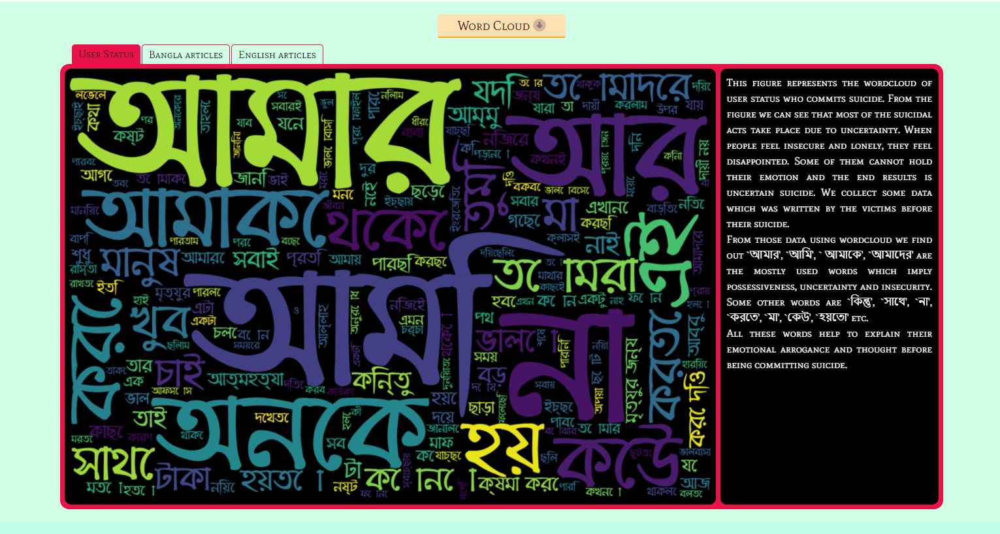
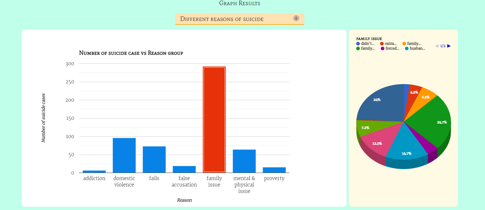
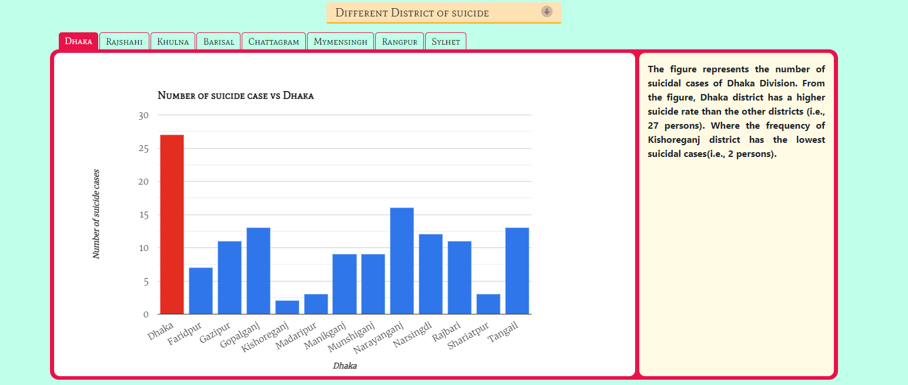
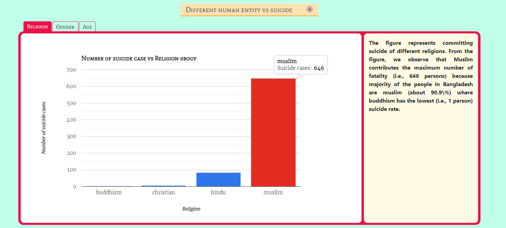
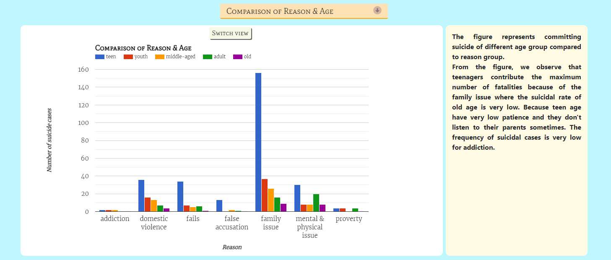

# Suicide-Prevention
 This is an application to showcase our thesis project. (Completed 2021)

This project showcase our thesis results that we done for suicide prevention. This project is based on suicide happend during this pendemic. Throughout this project we showcase all the results that we have got using different Machine learning methods.

Here is the live link : [@suicideanalytics](https://suicideanalytics.sociocognitive.com/result)
Also check : [@socioCognitive](https://sociocognitive.com/)

 ## Project description
Name: Suicide-Prevention  
Fronted Language: HTML, CSS, JS  
Backend : python (Django)  
Platform: WEB  
Project No: 27  
Year: 2021

## Results:
<ul> 
    <li>WordCloud (User status, Bangla & English news article)</li>
    <li>Different reasons of suicide.</li>
    <li>Different methods of suicide.</li>
    <li>Different area (Division) of suicide.</li>
    <li>Different District(8) of suicide.</li>
    <li>Profession group vs suicide.</li>
    <li>Different Human Entity (religion, gender, age) vs suicide.</li>
    <li>Different forecast (time, month, weather) vs suicide.</li>
    <li>Economical Condition vs suicide.</li>
    <li>Reason vs Gender.</li>
    <li>Methods vs Gender.</li>
    <li>Reason vs age.</li>
    <li>Economic condition vs age.</li>
    <li>Reason Clustering.</li>
</ul>

## Demo Video
<!--  -->

## Screen shot

### Home

### Team

### Contacts

### Results

### WordCloud (user status)

### Reason

### Different District

### Different Human entity

### Reason Vs Age

### Cluster

## Authors

* **AbirHasan**
* **ArafatHossain**

Check out his work [@Arafat Hossain](https://github.com/arafat006)

Check out my other works [@XAbirHasan](https://github.com/XAbirHasan)
